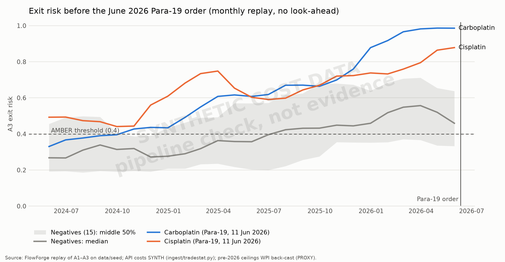

# Para-19 backtest: pipeline check (not evidence)

Generated by `python tests/backtest_para19.py` · plan §4.5 · weights `rules/weights.yaml` v1.0.0 (frozen)

> **Read this first.** The API cost series are **synthetic** (`ingest/tradestat.py`, IS_PROXY = SYNTH) because TradeStat could not be downloaded in time, and they are anchored on today's ceilings, which for the positives are the *post-order* ceilings. Only 2 confirmed Para-19 formulation(s) can be scored. These numbers show that the replay runs end to end without look-ahead; they say nothing about whether the signal works. Do not put them on a slide as results.

## Setup

- Window: Jun 2024 – Jun 2026, one snapshot per month; each snapshot holds only rows dated before that month (asserted for `FF_REF_CEILING_PRICE`, `FF_REF_API_COST_MONTHLY`, `FF_REF_API_ORIGIN`, `FF_REF_WPI`, `FF_REF_NSQ_ALERT`).
- Positives scored: **2** — `CARBOPLATIN-49C2E049` (order 2026-06-11), `CISPLATIN-1C3AF2A6` (order 2026-06-11).
- Skipped: **13** event rows still marked `VERIFY=true`; **5** confirmed rows with no API cost model (vaccines/immunoglobulins): `ANTI-TETANUS-IMMUNOGLOBU-7F67B0A3`, `ANTI-TETANUS-IMMUNOGLOBU-D77E974E`, `BCG-VACCINE-961273DA`, `MEASLES-RUBELLA-VACCINE-167F0074`, `MEASLES-VACCINE-94806A0B`.
- Excluded from negatives: 15 Para-19-flagged targets awaiting verification (they may be positives).
- Negatives: 15 targets sampled with seed 42 from the non-Para-19 targets that have a cost model.
- Ceilings before April 2026 are back-cast by the annual WPI change (MANUFACTURED_PRODUCTS, DPCO para 16): 2715 PROXY rows.
- A flag = A3 exit-risk band AMBER or RED in a month where A1 had both a ceiling and a cost series. Lead time = order date − as-of date of the first flag in the 24 months before the order; "≥" means it was already flagged in the first month of the window (censored).
- Precision@10 and the negative flag rate are taken at the last snapshot before the order month; with 2 positive(s) the best possible precision@10 is 0.2.

## Results

| Scenario | Lead time (median, range) | Recall | Precision@10 (max 0.2) | Negatives flagged |
|---|---|---|---|---|
| base | ≥ 664 d (range 588–≥ 741) | 100% | 0.20 | 67% |
| cost −20% | 315 d (range 162–468) | 100% | 0.20 | 20% |
| cost +20% | ≥ 741 d (range 741–≥ 741) | 100% | 0.20 | 87% |

Per positive (base):

| Formulation | Order date | Lead time | Rank by exit risk |
|---|---|---|---|
| `CARBOPLATIN-49C2E049` | 2026-06-11 | 588 d | 1 of 17 |
| `CISPLATIN-1C3AF2A6` | 2026-06-11 | ≥ 741 d | 2 of 17 |

## What this shows

In the base run 2 of 2 positive(s) were flagged before the order (≥ 664 d (range 588–≥ 741)), and 67% of negatives were flagged at the same time. Lead times marked ≥ hit the window edge: the formulation was flagged from the first snapshot, which with synthetic costs reflects where the random walk started, not an early warning. The flag is not selective: most negatives are flagged too, so the lead time on its own means little. Under ±20% cost the share of negatives flagged ranges from 20% to 87% and the median lead time from 315 d (range 162–468) to ≥ 741 d (range 741–≥ 741): the outcome is driven by the level of the cost proxy, not by a stable signal. **This is weak, and it is not evidence either way**: with synthetic costs and two positives the backtest can only show that the replay machinery works without look-ahead.

## Caveats

- **Proxy and synthetic inputs.** API cost is a seeded random walk, not TradeStat. Conversion, packaging and freight costs are BOM assumptions. Ceilings before April 2026 are WPI back-casts.
- **Built-in leakage on the cost side.** Each synthetic cost series ends at a level set from today's ceiling. For the positives that is the raised ceiling, so the history is derived from the outcome.
- **Static structure.** Producer lists and market shares are today's; the replay can't see past entries or exits.
- **Tiny sample.** 2 positive(s) from one order (2026-06-11); 15 negatives. Any single formulation moves recall by 50%.
- **No publication lag.** A snapshot sees the previous month's cost; real trade data arrives about two months late.

## Weights

No weight change. With synthetic, outcome-anchored costs and two positives, any tuning would fit noise. `rules/weights.yaml` is frozen at v1.0.0 (hand-set, plan §4.3). Re-run this script once the Oct-2024 / Dec-2019 Para-19 rows are verified and real TradeStat series replace the synthetic ones.

